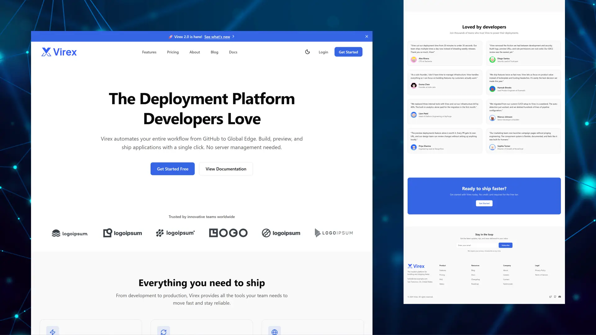
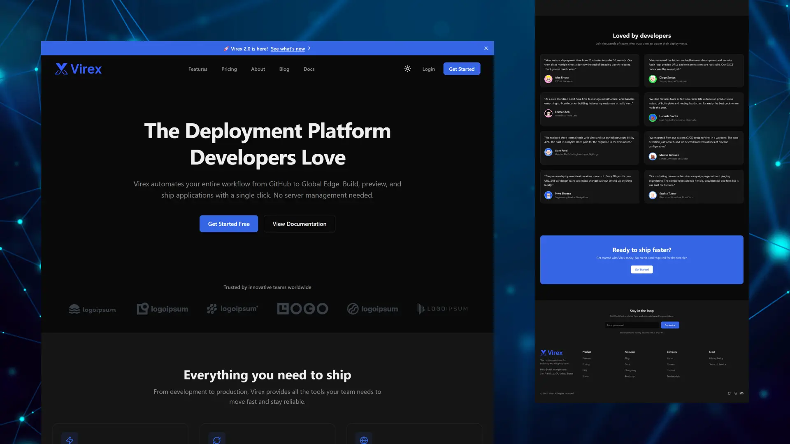

# Virex - SaaS UI Theme for Astro

[](https://astro.build)
[](https://opensource.org/licenses/MIT)

A production-ready SaaS theme for Astro. Designed to help you go from idea to launch quickly, Virex includes marketing pages, documentation, and a dashboard UI. Built with a strong focus on performance, simplicity, and easy customization.

## Why Virex?

Unlike many Astro themes that focus only on marketing pages, Virex also includes a production-ready dashboard UI. You get not just landing pages, but a structured dashboard layout with reusable components and example pages for common SaaS workflows.

This allows you to move faster—from an initial landing page to an MVP dashboard UI—while keeping a consistent design system, theming, and code quality across your entire project.

## Demo




**Live Demo**: [https://virex.erland.me](https://virex.erland.me)

## Features

### Built for Performance

Modern tech stack with Astro, TypeScript, and Tailwind CSS v4. Optimized for speed and developer experience.

### Complete Content System

Content collections for blog, documentation, changelog, and testimonials. Markdown/MDX support with auto-generated navigation.

### Fully Customizable

Design tokens (OKLCH color system), dark mode, feature flags, and 200,000+ icons. Make it yours in minutes.

### Dashboard Ready

Pre-built dashboard layouts with reusable components. Perfect starting point for SaaS applications.

### Production Ready

SEO-optimized, accessible, with legal pages and contact forms. Everything you need to launch.

## Quick Start

```bash
npm create astro@latest -- --template erlandv/virex
```

Then follow the prompts to name your project and choose your package manager. Once installed:

```bash
cd your-project-name
npm run dev
```

Open [http://localhost:4321](http://localhost:4321) to see your site.

### Alternative Installation (for theme development)

If you want to contribute to the theme or explore the full git history:

```bash
# Clone the repository
git clone https://github.com/erlandv/virex.git
cd virex

# Install dependencies
npm install

# Start development server
npm run dev
```

## Key Features

### Marketing Pages

A complete set of landing pages designed for SaaS marketing and conversion.

**Includes**: hero sections, feature grids, pricing tables, testimonials, FAQs, contact forms, team pages, case studies, and integrations showcases.

### Dashboard System

A flexible dashboard layout with sidebar navigation, reusable UI components, and example pages for common SaaS workflows.

**Includes**: Overview, settings, projects pages • StatCard, DataTable, Chart, Modal, Toast components • Full light/dark mode support

**Routes**: `/dashboard`, `/dashboard/settings/*`, `/dashboard/projects`

**Important**: Dashboard pages use starter templates with sample data. Authentication is not included and must be implemented by the user.

### Content Management

Built-in content collections for blog posts, documentation, changelog entries, and testimonials with full Markdown and MDX support.

**Includes**: paginated blog with tags • auto-generated docs sidebar • changelog timeline • testimonials grid

### Developer Experience

A smooth developer experience with TypeScript, Tailwind CSS v4, and a clean project structure.

**Path aliases**: `@dashboard/*`, `@dashboard-ui/*`, `@components/*`, `@sections/*`, `@forms/*`, `@ui/*`, `@layout/*`

**Tools**: ESLint and Prettier configured • type-safe development • fast reload with Astro dev server

## Documentation

Full documentation is available in the [`docs/`](./docs/) folder:

1. **[Getting Started](./docs/01-getting-started.md)** - Installation and project structure
2. **[Configuration](./docs/02-configuration.md)** - Site settings and feature flags
3. **[Customization](./docs/03-customization.md)** - Design tokens, branding, and theming
4. **[Content Guide](./docs/04-content-guide.md)** - Managing blog, docs, changelog, and testimonials
5. **[Components](./docs/05-components.md)** - Icons, forms, and UI components
6. **[Pages](./docs/06-pages.md)** - Available pages and routing
7. **[Dashboard](./docs/07-dashboard.md)** - Dashboard layouts and components
8. **[Authentication](./docs/08-authentication.md)** - Authentication guidance
9. **[Deployment](./docs/09-deployment.md)** - Deploying to Vercel, Netlify, or Cloudflare

## Project Structure

```
src/
├── components/       # Reusable UI components
├── config/           # Site configuration
├── content/          # Blog, docs, changelog, testimonials
├── layouts/          # Page layouts
├── lib/              # Utilities and types
├── pages/            # Route pages
├── styles/           # Design tokens and global styles
└── content.config.ts # Content collections configuration
```

## Configuration

All configuration files are located in `src/config/`:

| File | Purpose |
|------|---------|
| `site.ts` | Site name, description, URL, social links |
| `features.ts` | Enable or disable sections |
| `navigation.ts` | Header and footer navigation |
| `contact.ts` | Contact information and methods |
| `content.ts` | Announcement bar and newsletter text |

## Scripts

| Command | Description |
|---------|-------------|
| `npm run dev` | Start development server |
| `npm run build` | Build the site for production |
| `npm run preview` | Preview the production build |
| `npm run lint` | Run ESLint |
| `npm run lint:fix` | Fix lint issues automatically |
| `npm run format` | Format files with Prettier |
| `npm run format:check` | Check formatting |
| `npm run check` | Run lint, format check, and Astro checks |

## License

Virex Theme is free for personal and commercial use under the [MIT License](./LICENSE). Attribution is not required, but a link back to this repository is always appreciated.
